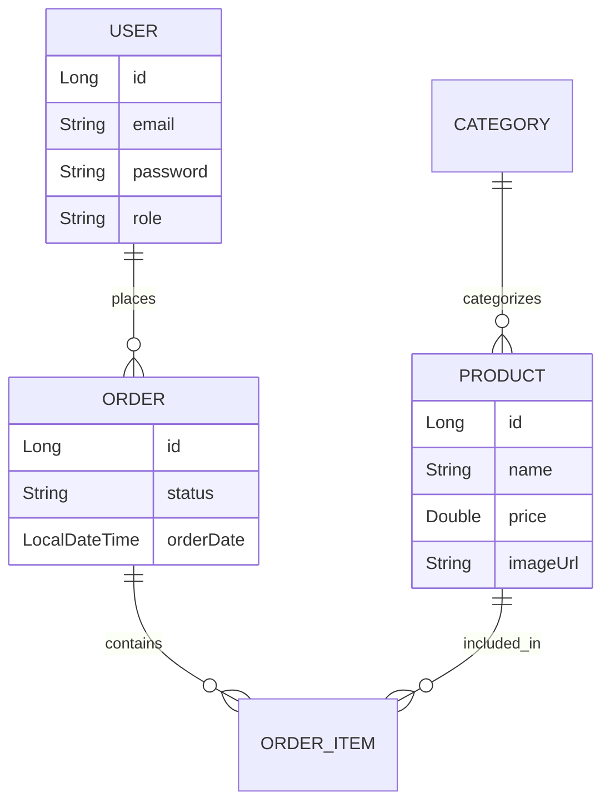

# E-commerce with Spring Boot

<div align="center">

[](https://ecommerce-with-spring-boot.onrender.com/)
[](https://github.com/MiguelAntonioRS/Ecommerce-with-Spring)
[](LICENSE)
[](https://github.com/MiguelAntonioRS/Ecommerce-with-Spring)

**A full-featured e-commerce platform built with Spring Boot**

</div>

---

## Table of Contents

- [Overview](#overview)
- [Features](#features)
- [Tech Stack](#tech-stack)
- [Architecture](#architecture)
- [Getting Started](#getting-started)
- [Database Schema](#database-schema)
- [API Endpoints](#api-endpoints)
- [Roadmap](#roadmap)
- [Contributing](#contributing)
- [License](#license)
- [Contact](#contact)

---

## Overview

**E-commerce with Spring Boot** is a comprehensive online store application that enables users to browse products, manage shopping carts, place orders, and receive email confirmations. It includes a secure administration panel for managing products, categories, orders, and users.

This project was built as a **personal learning initiative** to deepen my expertise in Spring Boot ecosystem, security implementation, and full-stack development practices.

> **Note:** This project is currently **in active development**. Some features may be under construction or subject to change.

---

## Features

### User Features
- **Authentication & Registration** – Secure sign-up/login with Spring Security
- **Product Catalog** – Browse products with filtering by category
- **Persistent Shopping Cart** – Cart saved across sessions
- **Order Management** – Complete checkout flow with order tracking
- **Email Confirmations** – Automated order confirmation emails (simulated in Render)
- **User Profile** – Manage personal information and order history

### Admin Features
- **Secure Admin Panel** – Role-based access control (ROLE_ADMIN)
- **Product CRUD** – Create, read, update, delete products with image upload
- **Category Management** – Organize products into categories
- **Order Management** – View and update order statuses:
  - `IN_PROGRESS` → `DELIVERED` / `CANCELLED`
- **User Management** – Manage registered users and roles

### Technical Features
- **Managed PostgreSQL on Supabase** – High-availability relational data with JPA/Hibernate, connected via Session Pooler for optimal performance.
- **Spring Security** – BCrypt password hashing, CSRF protection, session management
- **Spring Mail** – Email service integration (SMTP configuration)
- **Cloudinary Integration** – Product and profile images stored in the cloud with CDN delivery
- **Docker Support** – Containerized deployment ready
- **Cloud Deployment** – Live on Render with auto-deploy from GitHub

---

## Tech Stack

<div align="center">

### Backend


### Frontend


### Database & DevOps

 


</div>

---

## Architecture

```
src/main/java/com/miguel/ecommerce/
├── config/              # Security, Mail, Cloudinary config
├── controller/          # MVC controllers
├── entity/              # JPA Entities (User, Product, Order, etc.)
├── repository/          # Spring Data JPA repositories
├── service/             # Business logic (ProductService, CloudinaryService, etc.)
└── util/                # Utility classes

src/main/resources/
├── templates/          # Thymeleaf views
├── static/             # CSS, JS, images
└── application.properties
```

---

## Getting Started

### Prerequisites
- Java 17 or higher
- PostgreSQL 14+
- Maven 3.8+
- Docker (optional)

### Local Development

```bash
# 1. Clone the repository
git clone https://github.com/MiguelAntonioRS/Ecommerce-with-Spring.git
cd Ecommerce-with-Spring

# 2. Configure database (application-local.properties)
# Create database: ecommerce_db
# Update credentials as needed

# 3. Build the project
mvn clean install

# 4. Run the application
mvn spring-boot:run

# 5. Access the app
http://localhost:8080
Default admin: admin@example.com / admin123 (change in production!)
```

### Environment Variables (for Render/Production)

Create the following variables in your deployment platform (e.g., Render Dashboard):

```env
# Database (Supabase Connection String - JDBC Format)
# Format: jdbc:postgresql://[host]:[port]/[db]?user=[user]&password=[pass]
SPRING_DATASOURCE_URL=jdbc:postgresql://aws-0-us-west-2.pooler.supabase.co:5432/postgres?user=postgres.your_project_ref&password=your_secure_password

# Email (SMTP)
SPRING_MAIL_HOST=smtp.gmail.com
SPRING_MAIL_PORT=587
SPRING_MAIL_USERNAME=your_email@gmail.com
SPRING_MAIL_PASSWORD=your_app_password

# Cloudinary (for image uploads)
CLOUDINARY_CLOUD_NAME=your_cloud_name
CLOUDINARY_API_KEY=your_api_key
CLOUDINARY_API_SECRET=your_api_secret
```
---

## Database Schema



---

## API Endpoints (Sample)

| Method | Endpoint | Description | Auth |
|--------|----------|-------------|------|
| `GET` | `/api/products` | List all products | Public |
| `GET` | `/api/products/{id}` | Get product details | Public |
| `POST` | `/api/cart/add` | Add item to cart | User |
| `POST` | `/api/orders` | Create new order | User |
| `GET` | `/api/admin/users` | List all users | Admin |
| `PUT` | `/api/admin/orders/{id}` | Update order status | Admin |

> All admin endpoints require `ROLE_ADMIN`. User endpoints require authentication.

---

## Roadmap

- [x] Migrated product and profile images to **Cloudinary** ✅
- [ ] Add unit tests with JUnit + Mockito
- [ ] Integrate payment gateway (Stripe / PayPal)
- [ ] Add advanced search & filters (price range, ratings)
- [ ] Implement product reviews & ratings system
- [ ] Optimize for mobile with responsive PWA features
- [ ] Add analytics dashboard for admin
- [ ] Refactor service layer by feature (e.g., `user/service/`)

*Have an idea? Open an issue or submit a PR!*

---

## Contributing

Contributions are welcome! This is a learning project, so feel free to:

1. Fork the repository
2. Create your feature branch (`git checkout -b feature/AmazingFeature`)
3. Commit your changes (`git commit -m 'Add some AmazingFeature'`)
4. Push to the branch (`git push origin feature/AmazingFeature`)
5. Open a Pull Request

### Guidelines:
- Follow the existing code style
- Add comments for complex logic
- Test your changes locally
- Update documentation if needed

---

## License

Distributed under the **MIT License**. See `LICENSE` for more information.

```
MIT License

Copyright (c) 2026 Miguel Antonio Rojas Sucarino

Permission is hereby granted, free of charge, to any person obtaining a copy
of this software and associated documentation files (the "Software"), to deal
in the Software without restriction, including without limitation the rights
to use, copy, modify, merge, publish, distribute, sublicense, and/or sell
copies of the Software, and to permit persons to whom the Software is
furnished to do so, subject to the following conditions:

The above copyright notice and this permission notice shall be included in all
copies or substantial portions of the Software.
```

---

## Contact

<div align="center">

**Miguel Antonio Rojas Sucarino**

[](https://github.com/MiguelAntonioRS)
[](https://www.linkedin.com/in/miguel-antonio-rojas-sucarino-0299a42b3/)
[](mailto:rojassucarinomiguelantonio@gmail.com)

</div>

---

<div align="center">

### If you found this project helpful, give it a star!

**Built with care by Miguel Antonio**

</div>

---

## Project Stats

<div align="center">


</div>